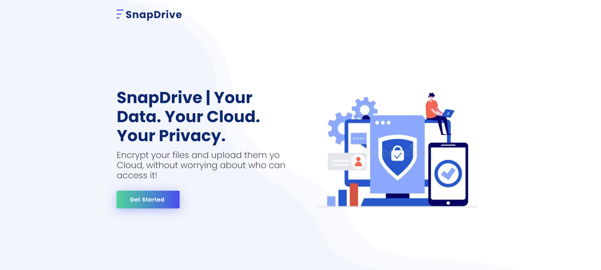
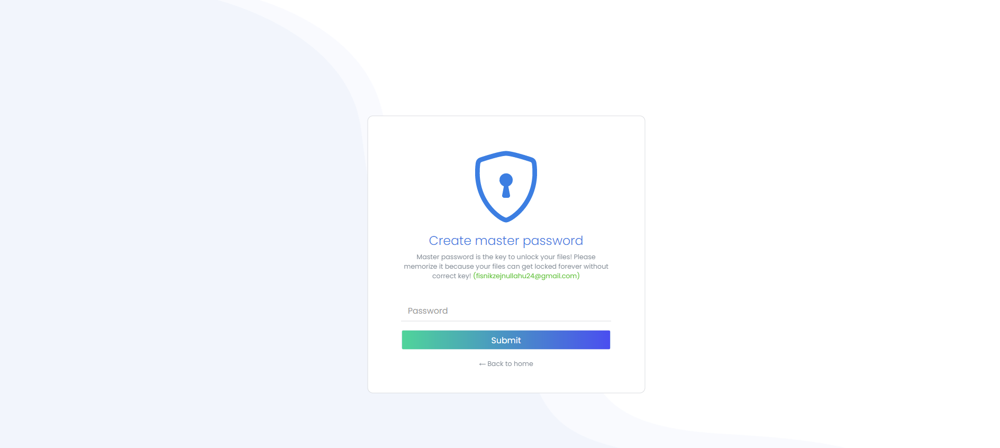
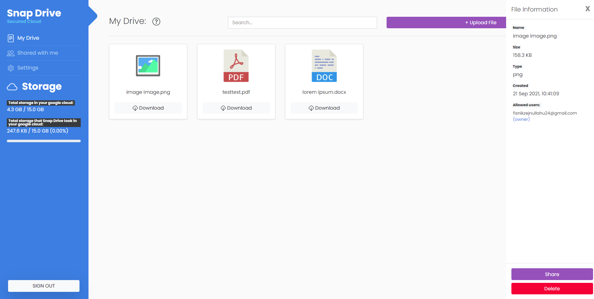

# Snap Drive
**Snap Drive** is an application that protects privacy of data that is stored 
on public clouds (Snap Drive implements file uploading only in Google Drive). 
The protection our of data gets achieved by using encryption, especially using the idea of end to end encryption.

> **Note:** Snap Drive is not a "real production application". Snap Drive it's more about the idea 
> how you can use encryption algorithms to protect your data. So don't use it
> as a tool to encrypt your files. As the Snap Drive application implements a lot about
> encryption and uploading in Google Drive, it's not fully tested to be a production ready application. 

> **Google Drive API requirements:** Snap Drive uses Google Drive apis to upload files. So, there should 
> be created a Google client that can be used to access Google Drive API itself. (https://developers.google.com/drive/api/v3/about-sdk).
> I've created a simple project in Google Cloud (https://developers.google.com/workspace/guides/create-project) and enabled the
> Google Drive API. Drive API is one of what's called 'sensitive scope' (https://developers.google.com/identity/protocols/oauth2/scopes). 
> As for these sensitive scopes Google requires a verification process to make it available to everybody.
> I didn't go through this process for my Snap Drive project, so you can't use it 
> when you try to login with google in Snap Drive. Only if I add your email to allowed test users in my project.
> But it's very simple to create your own Google Drive API client and then download your credentials or serviceAccount.json file and paste it in directory (`snap-drive-api/`).
> You also should write some information about your client in `snap-drive-api/src/main/resources/application.properties`.
> Also you should write your client_id in `main.js` file in snap-drive-vue-app. 
## Screenshots

| Home Page                                                                                                         | Creation of master password                                                                                                    |
| ----------------------------------------------------------------------------------------------------------------- | ------------------------------------------------------------------------------------------------------------------ |
|  |  |
| User files (after login and decryption)
| 

## Architecture
Snap Drive consists three applications. It has a frontend that is implemented in `Vue.js`, 
this frontend communicates with a localhost application that is written in `Java (using Quarkus)`.
Also, there is the third application, that it is also written in `Java (using Quarkus)`.
This application will be used as a public api of Snap Drive. Its responsibility 
is managing application users.

**How applications work?**

Idea is using two applications in user's local machine: 
1. frontend `Vue.js` that user will be using in browser
2. A java application that will handle work to be done with files such as encryption, uploading in Google Drive, sharing, deleting etc. 
It will also be used to authenticate users of Snap Drive by calling public api of Snap Drive, and fetching necessary user's info.

I didn't want to build a desktop app, that's why I implemented this idea instead, with 
two applications that run in a single user machine. 

The third application is used to manage users such as creation and persisting their personal info
such as email, public and private keys (`more info in encryption section`) in database.
In case of Snap Drive, all of users info is stored in Google Firestore.  

## The encryption of files
**Encryption in Snap Drive** is done using sorts of different encryption algorithms.
Let's mention those algorithms, and then I'll talk about how I used them together to make a secured file. 
- **AES:**  File's content and file's name, are encrypted using AES.
When a file is ready to be encrypted, a random AES key gets generated, and the file gets encrypted with that key.
- **PBDKF2:** Each user on process of creating account, will be prompted
to write a password (that is called `master password`). Master password will be given
in plain text as desire of user. But, plain password is not safe to use as encryption key.
So, to make it a safe secret key we use a secure `key derivation function` to derive
a safe encryption key from user's master password. Snap Drive uses `PBKDF2` to achieve that.
- **RSA:**  In Snap Drive files can safely be shared with others. No one else except sender
and receiver know the file's content. 
How sharing safely is done? By using `asymmetric public-private keys`.
Snap Drive uses RSA. When a user first creates an account, RSA key pair will be generated. 
- **ChaCha20:**  We use ChaCha20 to encrypt user private RSA key (`more info below`). 

**How Snap Drive uses these algorithms together?**

I mentioned that files gets encrypted with AES random keys. 
To achieve safely upload and accessibility for those files in Google Drive
we need somehow to store `AES` file encryption keys. We store them in a `separate json config file`, 
separate of original file's content. We then zip the encrypted file and the config file in a single ZIP file and upload to Google Drive. 
But, it isn't "secured" if we store file keys  in their original form. 
We need to encrypt those keys. This is done by using user's public key to encrypt
each of his `AES` file keys. We can then decrypt each of user's file keys using `RSA` private key, then use that decrypted file key to decrypt the file itself.
But files are uploaded in cloud and we want to access them from anywhere.
In this case we need to know user's private key. We need to store it somehow. But how to store private key? We use combination of `PBDFK2` and `ChaCha20`.
When a user creates master password, this password will be derived as a secret key using `PBDKF2`.
After a secret key gets derived from user's password, we use that secret key to encrypt `RSA` private key using `ChaCha20`.
At the end, after we encrypt user's private key, we send it safely to store in Snap Drive users database.

**No one else does not know anything about files content or encryption keys:**

The idea of end to end encryption is to prevent third parties from accessing data while it's transferred from one end system or device to another.
In case of Snap Drive, this means that the files will never `get out` of user local machine without being encrypted. 
Both, encryption and decryption happens only in user's local machine.
Even master password will never be sent anywhere without being safely encrypted 
as I mentioned earlier (by use of `PBDKF2` and `ChaCha20`).

**How file sharing works?**
 
Sharing the files securely, is based on `asymmetric public-private keys` methods.
Remember that `AES file key` are encrypted using public key, and then that encrypted key is written in a `json config file`?
We use that technique to share the files. When we want to share to specific user, we make a GET request
in Snap Drive public api to get the public key of the recipient user (which are stored in Firestore).
We then encrypt the original `AES file key` using recipient public key.
The result of recipient encrypted file key will be written in `json config file` as a json object that contains recipient userId and the encrypted file key. 
Then, upload to GoogleDrive happens.
Recipient user now have access in that file by using google drive. When a user wants to see files that are shared to him
he gets all shared files to him by using Google Drive API, and for each of those files he reads `json config file`, he gets
his `file key (encrypted with his own public key)`. He then decrypts this key by using his personal private key. 

**Changing user master password:**
 
In anytime user can change his master password. This will
be a fast process because of the architecture that Snap Drive is built on. 
When user changes master password he doesn't need to re-encrypt each of his files! 
He only re-encrypts his private key (in his local machine) and then makes an HTTP request in Snap Drive public api to 
update his info.

## Run 

There are two ways of running Snap Drive applications. Using Docker containers or by individually
starting them.

1. **Start all services as Docker containers:** 
Just execute `build.bat` file, and it will build jars and call docker-compose up for you.

2. **Build and run the individual projects:**
On java projects `snap-drive-api/`, `snapdrive-local-api/`, execute `mvn clean package` then you can use java -jar (runner jar).
You can also use dev mode of Quarkus. So in each project you call mvn clean compile quarkus:dev (remember different debug ports for projects -Ddebug=5005,-Ddebug=5006) 
**[You can read more about how you can run Quarkus application here.](https://quarkus.io/guides/maven-tooling)**

As for the `snap-drive-vue-app/`, you can start it using `yarn serve --port 8883` (port localhost:8883 is accepted as cors origin by local Java application).